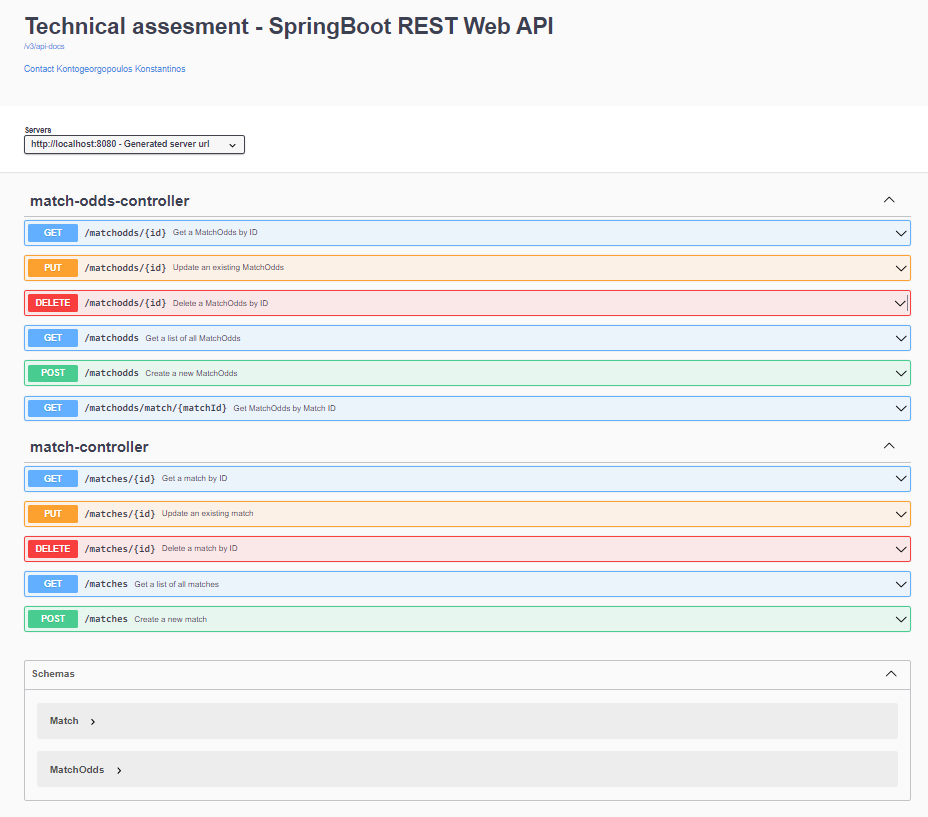

# Technical Assessment Documentation

## Objective

The objective of this technical assessment is to develop a REST Web API using the following technologies:

- Java
- Spring Boot
- JPA for database access (Spring Data or Hibernate) [optional]
- PostgreSQL
- Maven

## Business Goal

The primary goal is to create an API for managing matches and their odds. This involves handling information related to matches and their associated odds.

## Running the Application 

To run the application using Docker Compose, follow these steps:

- Make sure you have Docker and Docker Compose installed on your system. If not, you can download and install them from the official Docker website.

- Navigate to the `TechnicalAssesment` directory in your terminal or command prompt.

- Use the following command to start the application:
```bash
docker-compose up -d
```

- Wait for the containers to start. You can monitor the progress by checking the logs:
```bash
docker-compose logs -f
```

- Once the containers are up and running, you can access the application at http://localhost:8080


- To stop the application and remove the containers, use the following command:

```bash
docker-compose down
```

## API Documentation

You can find the detailed Rest Web API documentation at:

http://localhost:8080/swagger-ui/index.html




## Architecture

### Entities

#### Match

- `id`: Unique identifier for the match.
- `description`: Description of the match.
- `match_date`: Date of the match.
- `match_time`: Time of the match.
- `team_a`: Name of Team A.
- `team_b`: Name of Team B.
- `sport`: Type of sport (Enum with values: Football, Basketball).

#### MatchOdds

- `id`: Unique identifier for the odds.
- `match_id`: Identifier linking the odds to a specific match.
- `specifier`: Specifier for the odds.
- `odd`: Odds value.

### Enums 

#### Sports

Enum to store the Sports values.
(Football, Basketball)

### Controllers

#### MatchController

Controller class for handling HTTP requests related to matches. Provides
endpoints for performing CRUD operations on Match entities.

#### MatchOddsController

Controller class for handling HTTP requests related to MatchOdds. Provides
endpoints for performing CRUD operations on MatchOdds entities.

### Repositories

#### MatchRepository

Repository interface for performing CRUD operations on Match entities.

#### MatchOddsRepository

Repository interface for performing CRUD operations on MatchOdds entities.

### Services

#### MatchService

Service interface for handling operations related to matches.

#### MatchServiceImpl

Implementation of MatchService.

#### MatchOddsService

Service interface for handling operations related to match odds.

#### MatchServiceImpl

Implementation of MatchOddsService.

#### MatchServiceTest

Tests for Match Service use cases.

# Contact info:

k.kontogeorgo@gmail.com
